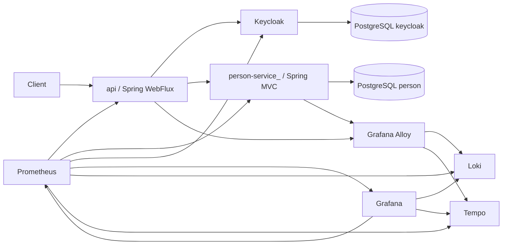

# Persons Microservices Project

A portfolio-ready demo of a microservice-based backend platform built with **Spring Boot**, **Keycloak**, **PostgreSQL**, and a full **observability stack**.

The project demonstrates how to design and run a small distributed system around a real user lifecycle: **registration, authentication, token refresh, profile access, person data storage, audit history, metrics, logs, traces, and containerized local infrastructure**.

---

## Architecture overview

The system is composed of two application services and a supporting infrastructure layer:

- **api** — reactive edge/orchestration service built on **Spring WebFlux**
  - handles registration, login, refresh-token and `/me`
  - communicates with Keycloak
  - communicates with the person domain service through a generated client
  - validates JWT access tokens as a Resource Server

- **person-service_** — domain service built on **Spring MVC + Spring Data JPA**
  - stores and manages person-related data
  - exposes person registration and lookup APIs
  - supports soft delete / hard delete compensation flow
  - persists audit history in a dedicated schema

- **Infrastructure layer**
  - **PostgreSQL** for business data and Keycloak data
  - **Keycloak** for identity and access management
  - **Nexus Repository** for publishing generated OpenAPI artifacts
  - **Prometheus** for metrics scraping
  - **Grafana** for dashboards
  - **Loki** for log aggregation
  - **Tempo** for distributed tracing
  - **Grafana Alloy** for log collection and OTLP ingestion

---

## High-level request flow



---

## Registration scenario

One of the most interesting parts of the project is the **registration orchestration flow** implemented in the `api` service.

### Flow

1. The client sends a registration request to `api`
2. `api` creates the person record in `person-service_`
3. `api` obtains an admin token from Keycloak
4. `api` creates the user in Keycloak
5. `api` sets a permanent password in Keycloak
6. `api` logs in the newly created user and returns an access token + refresh token

### Compensation logic

If the Keycloak part fails after the person record was already created, the `api` service triggers a **compensation request** to `person-service_` and performs a hard delete.

This makes the project more interesting than a standard CRUD sample because it demonstrates **cross-service consistency handling** in a distributed workflow.

---

## Main business capabilities

### `api` service

Exposes authentication-oriented endpoints:

- `POST /v1/auth/registration` — register a new user
- `POST /v1/auth/login` — authenticate by email and password
- `POST /v1/auth/refresh-token` — refresh an access token
- `GET /v1/auth/me` — return data about the currently authenticated user

Security rules are configured so that:

- public access is allowed to health, metrics, Swagger, registration, login, and refresh-token endpoints
- `/v1/auth/me` requires authority `ROLE_individual.user`
- all other requests require authentication

### `person-service_`

Exposes person-domain operations through a generated OpenAPI interface:

- person registration
- get person by ID
- find persons by email list
- update person data
- soft delete
- hard delete for compensation

---

## Tech stack

### Backend

- **Java 24**
- **Spring Boot 3.5.0**
- **Spring WebFlux** (`api`)
- **Spring MVC / Spring Web** (`person-service_`)
- **Spring Security OAuth2 Resource Server**
- **Spring Data JPA**
- **OpenFeign**
- **MapStruct**
- **Lombok**
- **Hibernate Envers**
- **Flyway**

### API contracts and integration

- **OpenAPI Generator**
- generated DTOs and clients from OpenAPI specs
- publishing generated artifacts to **Nexus**

### Security

- **Keycloak**
- JWT-based authentication
- admin API interaction for user creation and password setup

### Observability

- **Micrometer**
- **Prometheus**
- **Grafana**
- **Loki**
- **Tempo**
- **OpenTelemetry OTLP exporter**
- **Grafana Alloy**
- custom login metric via AOP (`LoginMetricAspect`, `LoginCountTotalMetric`)

### Testing

- **JUnit 5**
- **Testcontainers**
- **WireMock Testcontainers module**
- integration tests for auth lifecycle

### Infrastructure & DevOps

- **Docker Compose**
- **Makefile**
- **Nexus Repository 3**
- **PostgreSQL 17**

---

## Project structure

```text
.
├── api/                        # Reactive API/orchestration service
│   ├── openapi/                # OpenAPI specs for external/internal contracts
│   ├── src/main/java/...
│   │   ├── client/             # Keycloak client integration
│   │   ├── config/             # Security, app config, JWT converter
│   │   ├── mapper/             # DTO/entity/api mappers
│   │   ├── metric/             # Custom metrics
│   │   ├── aspect/             # AOP metric instrumentation
│   │   ├── rest/               # Auth REST controller
│   │   ├── service/            # Registration/login orchestration
│   │   └── util/
│   └── src/test/java/...      # Integration test environment with containers
│
├── person-service_/            # Person domain microservice
│   ├── openapi/                # Person service OpenAPI contract
│   ├── src/main/java/...
│   │   ├── entity/             # JPA entities
│   │   ├── repository/         # Persistence layer
│   │   ├── mapper/             # MapStruct mappers
│   │   ├── rest/               # OpenAPI-backed controller
│   │   ├── service/            # Domain business logic
│   │   └── exception/
│   └── src/main/resources/
│       └── db/migration/       # Flyway SQL migrations
│
├── infrastructure/
│   ├── alloy/                  # Alloy config for logs and OTLP
│   ├── databases/              # DB init scripts
│   ├── grafana/                # Datasources, dashboards provisioning
│   ├── keycloak/               # Realm import config
│   ├── loki/
│   ├── prometheus/
│   └── tempo/
│
├── docker-compose.yml          # Full local environment
└── Makefile                    # Startup / rebuild automation
```

---

## OpenAPI-first approach

Both services include OpenAPI specifications in dedicated `openapi/` directories.

The build is configured so that:

- specifications are discovered automatically
- Java sources are generated before compilation
- generated clients/models are added to source sets
- artifacts can be packaged and published to Nexus


---

## Persistence model

The `person-service_` stores data in PostgreSQL and organizes it into two schemas:

- `person` — operational data
- `person_history` — audit history

### Core entities

- `Country`
- `Address`
- `User`
- `Individual`

### Database features used

- **Flyway migrations** for schema evolution
- preloaded countries reference data
- **UUID** identifiers for domain records
- **Hibernate Envers** for history tables and revision tracking
- soft delete and hard delete support in the domain service

---

## Observability

The project includes a full local observability stack.

### Metrics

Prometheus scrapes metrics from:

- `api`
- `persons-api`
- `keycloak`
- `grafana`
- `loki`
- `tempo`
- `alloy`
- PostgreSQL exporters for both databases

### Logs

Alloy reads Docker container logs and forwards them to Loki.

### Traces

Both application services export telemetry through OTLP, and traces are sent to Tempo.

### Dashboards

Grafana is provisioned with datasources for:

- Prometheus
- Loki
- Tempo

---

## Testing strategy

The `api` service includes integration tests covering the authentication lifecycle.

The test environment uses:

- **Testcontainers**
- a dedicated **Keycloak test container**
- **WireMock** for controlled external behavior
- dynamic Spring property injection for container endpoints

Covered scenarios include:

- user registration and token issuance
- login with existing credentials
- `/me` endpoint verification for the authenticated user

---

## Running locally

### Option 1 — via Makefile

```bash
make all
```

Main targets:

```bash
make up
make build-artifacts
make start
make stop
make clean
make logs
make rebuild
```

### Option 2 — via Docker Compose

```bash
docker-compose up -d
```

---

## Local services

After startup, the environment exposes the following main endpoints:

- `api` — `http://localhost:8091`
- `persons-api` — `http://localhost:8092`
- `Keycloak` — `http://localhost:8080`
- `Nexus` — `http://localhost:8081`
- `Grafana` — `http://localhost:3000`
- `Prometheus` — `http://localhost:9090`
- `Loki` — `http://localhost:3100`
- `Tempo` — `http://localhost:3200`

---

## Summary

**Persons Microservices Project** is a compact but technically rich backend platform that demonstrates more than basic REST development.

It combines:

- microservices
- contract-first integration
- security
- persistence
- auditability
- observability
- automated local infrastructure
- integration testing
